# Universal DevOps Code Repository Template Guidelines

This document serves as the definitive guideline for all stakeholders involved in the DevOps process regarding
the structure, procedures, and task automation within this universal code repository template. The repository
is designed to be utilised for any project and any platform while strictly adhering to the DevOps loop and
Test-Driven Development (TDD) methodology. All instructions herein are stated in formal British English.

## 1. Repository Structure

The repository must follow a standardised structure as outlined below. This structure ensures consistency, automation, and ease of maintenance:

```yaml
/
├── iac/
│   ├── helm/
│   ├── opentofu/
│   └── environment/
│       └── staging/
├── .config/
│   ├── nodejs/
│   └── megalinter/
├── tests/
│   ├── unit/
│   ├── integration/
│   └── e2e/
├── project/
│   └── Taskfile.yml
└── Taskfile.yml
```

- **Infrastructure-as-Code (IaC):** All infrastructure configuration files (e.g. Helm charts, Kubernetes manifests) must reside in the `iac/` directory.
- **Configuration Files:** All technology-specific configurations must be placed under `.config/<technology>/` (e.g. `.config/nodejs/`, `.config/megalinter/`).
- **Tests:** All test cases and scripts are to be maintained within the `tests/` directory, organised by test type (unit, integration, end-to-end).
- **Tasks:** All DevOps tasks must be implemented in the existing `project/Taskfile.yml` file, which provides the basic structure for all phases of the DevOps loop.

## 2. Language Standards

### 2.1. British English Standards

- **Spelling:** Use British spelling (e.g., 'utilise' not 'utilize', 'colour' not 'color')
- **Documentation:** All documentation must be written in clear, formal British English
- **Code Comments:** Comments within source code must use proper British English grammar and spelling
- **Commit Messages:** All commit messages must follow conventional commit format using formal British English
- **Variable Names:** While using standard programming conventions, any word-based variables should use British English spelling
- **Error Messages:** All user-facing error messages must be written in formal British English

### 2.2. Fundamental Principles

#### 2.2.1. KISS (Keep It Simple, Stupid)

The KISS principle is paramount in all aspects of our DevOps practices. Every component, from infrastructure to code, must adhere to this fundamental concept:

- **Simplicity First:** Always opt for the simplest solution that meets the requirements. Complexity should only be introduced when absolutely necessary and justified.
- **Clear Documentation:** All documentation must be straightforward and easily understood by new team members.
- **Minimal Dependencies:** Limit external dependencies to those that are strictly necessary.
- **Simple Workflows:** Create straightforward, linear workflows that are easy to understand and maintain.
- **Modular Design:** Break down complex systems into simple, self-contained modules.
- **Standard Patterns:** Utilise well-known, proven patterns instead of creating novel solutions.
- **Automated Yet Simple:** Automation should not introduce unnecessary complexity.

When implementing any aspect of this repository:
1. Question whether each component is as simple as it could be
2. Remove unnecessary abstractions and complexity
3. Ensure that the solution is maintainable by others
4. Document why complexity was necessary when simplicity cannot be achieved

#### 2.2.2. Test-Driven Development (TDD) ⚠️ MANDATORY WORKFLOW ⚠️

> 🚨 **ATTENTION! ATTENTION! ATTENTION!** 🚨
>
> **❗️ TDD IS NOT OPTIONAL - IT IS ABSOLUTELY MANDATORY ❗️**
>
> Every single feature, fix, or change MUST begin with a failing test. No exceptions.
>
> ```txt
> 🔴 1. Write a Failing Test First
>     commit type: test(scope): add failing test for new feature
>
> 🟢 2. Write Minimal Code to Pass
>     commit type: feat(scope): implement minimal solution to pass test
>
> 🔵 3. Refactor While Keeping Tests Green
>     commit type: refactor(scope): improve implementation while maintaining test
> ```
>
> **WHY THIS IS NON-NEGOTIABLE:**
> - Ensures code quality from the start
> - Prevents technical debt
> - Guarantees maintainable codebase
> - Provides living documentation
> - Forces better design decisions
>
> **❌ NEVER, EVER:**
> - Write code without a failing test first
> - Skip tests to save time
> - Add tests after implementation
> - Make a commit without the proper conventional commit type
>
> **✅ ALWAYS:**
> - Start with a red test
> - Write the minimal code to make it pass
> - Refactor only when tests are green
> - Follow the conventional commit format for each step:
>   - `test`: for adding/modifying tests
>   - `feat`: for implementing new features
>   - `fix`: for bug fixes
>   - `refactor`: for code improvements
>   - `docs`: for documentation updates
>
> 🎯 **Remember:**
> - If there's no failing test, you shouldn't be writing production code!
> - Every commit must follow the conventional format and reflect the TDD step!

#### 2.2.3. Double Verification Principle ⚠️ MANDATORY PRACTICE ⚠️

> 🚨 **CRITICAL SAFETY MEASURE** 🚨
>
> **❗️ DOUBLE VERIFICATION IS MANDATORY FOR ALL ACTIONS ❗️**
>
> Every significant action, particularly those involving system modifications or deletions, MUST undergo a double verification process.
>
> ```txt
> ✅ Double Verification Process:
> 1. Initial Verification
>    - Validate the intended action
>    - Check all parameters and conditions
>    - Verify the context and impact
>
> 2. Secondary Verification
>    - Re-validate with fresh perspective
>    - Cross-check against documentation
>    - Confirm all dependencies are considered
> ```
>
> **WHY THIS IS CRUCIAL:**
> - Prevents accidental system modifications
> - Reduces human error
> - Ensures data integrity
> - Maintains system stability
> - Protects against unintended consequences
>
> **❌ NEVER:**
> - Skip the double verification process
> - Rush through verifications
> - Assume correctness without checking
> - Proceed with uncertainty
>
> **✅ ALWAYS:**
> - Take time to verify twice
> - Document verification steps
> - Seek peer review when in doubt
> - Maintain verification logs
>
> 🎯 **Remember:**
> - If in doubt, verify again
> - Prevention is better than recovery
> - Every verification step saves potential future issues

## 3. DevOps Loop and Task Files

### 3.1. DevOps Phases

The repository is structured around the complete DevOps loop, which comprises the following phases:

1. **Plan**
2. **Code**
3. **Build**
4. **Test**
5. **Release**
6. **Deploy**
7. **Operate**
8. **Monitor**

> ⚠️ **MANDATORY ORDER** ⚠️
>
> DevOps phases MUST follow this strict order:
> 1. Plan → 2. Code → 3. Build → 4. Test → 5. Release → 6. Deploy → 7. Operate → 8. Monitor
>
> No phase may be skipped or executed out of sequence without explicit justification and approval.

### 3.2. Task Implementation

Each phase must be implemented by adding the corresponding tasks to the existing `project/Taskfile.yml` file.
This template file already contains the basic structure for all DevOps phases.
**No actions or commands are to be executed manually.** All operations must be automated and executed as part of the DevOps loop.
For example, any invocation of Kubernetes commands (e.g. `kubectl apply`) must occur solely within the appropriate `deploy` or `operate` tasks and must be fully parameterised.

### 3.3. Taskfile Structure

The repository uses two Taskfiles that work together to implement the complete DevOps loop:

```mermaid
graph TD
    A[Taskfile.yml] --> B[project/Taskfile.yml]
    A --> C[.config/devsecops/*.yml]
    A --> D[.config/tools/*.yml]

    subgraph "Root Taskfile"
        A
    end

    subgraph "Project-Specific Tasks"
        B
    end

    subgraph "DevOps Phases"
        C1[Taskfile.plan.yml]
        C2[Taskfile.code.yml]
        C3[Taskfile.build.yml]
        C4[Taskfile.test.yml]
        C5[Taskfile.release.yml]
        C6[Taskfile.deploy.yml]
        C7[Taskfile.operate.yml]
        C8[Taskfile.monitor.yml]
        C9[Taskfile.feedback.yml]
        C --> C1 & C2 & C3 & C4 & C5 & C6 & C7 & C8 & C9
    end

    subgraph "Development Tools"
        D1[bun]
        D2[commitizen]
        D3[commitlint]
        D4[copier]
        D5[dev]
        D6[docker-ce]
        D7[kaniko]
        D8[lizard]
        D9[megalinter]
        D10[nodejs]
        D11[podman]
        D12[yamllint]
        D --> D1 & D2 & D3 & D4 & D5 & D6 & D7 & D8 & D9 & D10 & D11 & D12
    end
```



1. **Root Taskfile (`/Taskfile.yml`)**
- Acts as the orchestrator for all DevOps operations
- Defines environment variables and flags to control task execution
- Includes multiple configuration Taskfiles from `.config/devsecops/`:
  ```yaml
  includes:
    devsecops:plan:
      taskfile: .config/devsecops/Taskfile.plan.yml
    devsecops:code:
      taskfile: .config/devsecops/Taskfile.code.yml
    # ... other DevOps phases
    project:
      taskfile: project/Taskfile.yml
  ```
- Includes optional tools and configurations (bun, commitizen, megalinter, etc.)
- Controls which DevOps phases are enabled through variables:
  ```yaml
  TASK_DEVSECOPS_PLAN_ENABLED: '{{.TASK_PLAN_ENABLED | default "true"}}'
  TASK_DEVSECOPS_CODE_ENABLED: '{{.TASK_CODE_ENABLED | default "true"}}'
  # ... other phase toggles
  ```

2. **Project Taskfile (`project/Taskfile.yml`)**
- Implements project-specific tasks for each DevOps phase
- Contains simple, focused implementations
- Each task corresponds to a DevOps phase:
  ```yaml
  tasks:
    plan:
      desc: Run project-specific plan tasks
    code:
      desc: Run project-specific code tasks
    # ... other phase tasks
  ```

The relationship between these files is straightforward:
- The root Taskfile includes the project Taskfile as `project`
- Each DevOps phase in the root Taskfile calls its corresponding project-specific task
- Project-specific implementations are kept separate from the DevOps framework
- The root Taskfile manages the environment and tool configurations

## 3.4. Task Variables Standards

Task variables must follow these standardised formats for consistency and maintainability:

1. **Variable Naming Convention**
```yaml
vars:
  TASK_COMPONENT_ENABLED: "{{ default "true" .TASK_COMPONENT_ENABLED }}"
```
- Use SCREAMING_SNAKE_CASE for all variable names
- Prefix all task-related variables with `TASK_`
- Suffix feature flags with `_ENABLED`
- Use descriptive middle components (e.g., `PLAN`, `CODE`, `BUILD`)

2. **Override Pattern**
- All variables should support override through environment variables
- Use the `.OVERRIDE_` prefix for override variables
- Always provide a sensible default value
- Example:
  ```yaml
  vars:
    TASK_PLAN_ENABLED: "{{ default "true" .TASK_PLAN_ENABLED }}"
    TASK_CODE_ENABLED: "{{ default "true" .TASK_CODE_ENABLED }}"
    TASK_BUILD_ENABLED: "{{ default "false" .TASK_BUILD_ENABLED }}"
  ```

3. **Value Standards**
- Use string literals for boolean values: `"true"` or `"false"`
- Keep the format consistent: `"{{ default "value" .VARIABLE }}"`
- Avoid using complex expressions in variable definitions
- Document any deviation from these standards

## 4. Task: Plan

### 4.1. Objectives and Automation

- **Objective:** Automate project maintenance and dependency management.
- **Automation:** Execute `task plan` to run all automated planning tools:
  - Dependency updates (e.g., Renovate)
  - Security advisories scanning
  - Automated issue tracking
  - Project configuration updates
- **Parameterisation:** All planning parameters must be defined as variables.

### 4.2. Renovate Usage

Renovate is provided under `/.config/renovate/` to automate dependency upkeep. Use the following tasks:

- **Validate configuration**
  - Command:
    ```bash
    task renovate:validate
    ```
  - Purpose: Ensures the Renovate configuration file is valid before running.

- **Dry-run (no changes)**
  - Command:
    ```bash
    task renovate:dry-run
    ```
  - Purpose: Executes Renovate locally in read-only mode to preview potential updates.

- **Variables**
  - `TASK_RENOVATE_USE_DOCKER`: `"true"|"false"` (default: `"false"`). If `true`, runs via Docker image; otherwise uses `npx`.
  - `TASK_RENOVATE_CONFIG`: path to configuration (default: `.config/renovate/config.json`).
  - `TASK_RENOVATE_REPOSITORY`: repository root to scan (default: `.`).

Notes:
- Projects generated via Copier utilise the minimal template `config.json.jinja` to update only the DevSecOps plugin version through `regexManagers`.
- This repository itself uses the full configuration `config.json`.

## 5. Task: Code

### 5.1. Quality Assurance

- **Objective:** Ensure that code quality and standards are maintained.
- **Automation:** Execute `task code` to run all code quality tools:
  - Code linters from `.config/megalinter/` directory
  - Style checkers
  - Static code analysis
  - Code formatting
- **Parameterisation:** All code operations and command-line options must be parameterised via environment variables (e.g. use `kubectl apply $OPTIONS` instead of hard-coded values).

## 6. Task: Build

### 6.1. Build Process

- **Objective:** Automate the build process for the project.
- **Automation:** All build steps must be executed through the `task build` file without manual intervention.
- **Parameterisation:** Ensure that build commands utilise variables for options and file paths.

## 7. Task: Test

### 7.1. Testing Strategy

Testing must be conducted strictly in Test-Driven Development (TDD) mode. The following guidelines apply:

#### 7.1.1. Testing Approaches

- **Dual Testing Strategy:**
  1. Business Logic Testing:
  - Unit tests for individual components
  - Integration tests for component interactions
  - End-to-end tests for complete workflows
  2. Infrastructure Testing:
  - Local Kubernetes testing using Kind clusters
  - Infrastructure deployment validation
  - Configuration and manifest testing
  - Service mesh and networking tests
  - Resource allocation and scaling tests

#### 7.1.2. Implementation Requirements

- **Automation:** All tests must be executed via `task test` without manual intervention
- **Environment:** Tests must be reproducible in isolated environments
- **Coverage:** Both business logic and infrastructure tests must maintain specified coverage thresholds
- **Reporting:** Test results must be automatically generated and archived

### 7.2. TDD Methodology

1. **Write a Failing Test:**
- Create a new test that is expected to fail.
- **Commit Message:** Use a conventional commit message (e.g. `test: add initial failing test for feature X`).

2. **Implement Minimal Code:**
- Write the minimal code required to make the failing test pass.
- **Commit Message:** Use a conventional commit message (e.g. `feat: implement feature X to pass test`).

3. **Refactor:**
- Refactor the code to improve structure, remove redundancies, and enhance security while ensuring that the test continues to pass.
- **Commit Message:** Use a conventional commit message (e.g. `refactor: clean up code for feature X after test pass`).

### 7.2 Test Sequences

All tests must be executed using the `task test` file and follow one of the two prescribed sequences:

#### **Full Lifecycle Sequence (Default)**
```yaml
Full lifecycle sequence:
└── default
    ├── dependency    (Install necessary tools, etc.)
    ├── cleanup       (Remove temporary files and artefacts.)
    ├── destroy       (Teardown infrastructure.)
    ├── syntax        (Perform basic linting.)
    ├── create        (Provision infrastructure on Kubernetes.)
    ├── prepare       (Configure or install the minimum required for testing.)
    ├── converge      (Execute tests.)
    ├── idempotence   (Re-run tests; no changes should occur.)
    ├── side_effect   (Simulate a side effect, for example, disrupt a master node.)
    ├── verify        (Ensure the system remains stable post side-effect.)
    ├── destroy       (Teardown infrastructure.)
    └── cleanup       (Perform additional cleanup.)
```

#### **TDD Lifecycle Sequence (Default)**
```yaml
TDD lifecycle sequence:
└── default
    ├── dependency    (Install necessary tools, etc.)
    ├── syntax        (Perform basic linting.)
    ├── create        (Provision infrastructure on Kubernetes.)
    ├── prepare       (Configure or install the minimum required for testing.)
    ├── converge      (Execute tests.)
    ├── side_effect   (Simulate a side effect, for example, disrupt a master node.)
    └── verify        (Ensure the system remains stable post side-effect.)
```

- **Parameterisation:** All test commands and sequences must employ variables instead of hard-coded values.

## 8. Task: Release

### 8.1. Release Process

- **Objective:** Prepare and package the application for deployment.
- **Automation:** All release-related steps must be encapsulated in the `task release` file.
- **Commit Messages:** Any tagging or version bump must follow the conventional commit format.

## 9. Task: Deploy

### 9.1. Deployment Process

- **Objective:** Automate the deployment of the application to the target environment.
- **Kubernetes:** All deployment operations must use Kubernetes exclusively.
  - **Infrastructure Testing:** Use `kind` for local Kubernetes cluster testing.
  - **Environment Management:**
    - All Kubernetes configurations MUST be environment-specific and stored in `iac/environment/<environment>/`.
    - Each environment MUST have its own `kubeconfig.yaml` file stored in `iac/environment/<environment>/kubeconfig.yaml`.
    - All `kubectl` commands MUST use the `--kubeconfig` flag or the `KUBECONFIG` environment variable pointing to the appropriate environment file.
    - Example: `kubectl --kubeconfig=iac/environment/staging/kubeconfig.yaml apply -f manifest.yaml`
  - **Commands:** Kubernetes commands must be fully parameterised (e.g. `kubectl apply $OPTIONS`).
- **Helm and Sealed Secrets:**
  - Deployments should be managed via Helm.
  - Secrets must be handled using `kubeseal` (sealed secrets).
- **Automation:** All deployment steps must be automated within the `task deploy` file.

## 10. Task: Operate

### 10.1. Operational Management

- **Objective:** Manage the operational aspects of the deployed application.
- **Automation:** All operational tasks, including scaling, log management, and maintenance, must be executed via the `task operate` file.
- **Parameterisation:** No manual commands; all operations must use variables.

## 11. Task: Monitor

### 11.1. Monitoring Process

- **Objective:** Monitor system performance and infrastructure health.
- **Automation:** The `task monitor` file must be used to collect metrics, logs, and alerts.
- **Parameterisation:** Ensure that monitoring commands utilise environment variables.

## 12. Environment Management

### 12.1. Environment Structure

The `iac/environment/` directory is a critical component of the infrastructure and MUST be structured as follows:

```yaml
iac/
└── environment/
    ├── development/
    │   ├── kubeconfig.yaml    # Development cluster configuration
    │   └── values.yaml        # Environment-specific Helm values
    ├── staging/
    │   ├── kubeconfig.yaml    # Staging cluster configuration
    │   └── values.yaml        # Environment-specific Helm values
    └── production/
        ├── kubeconfig.yaml    # Production cluster configuration
        └── values.yaml        # Environment-specific Helm values
```

### 12.2. Kubernetes Configuration Management

1. **Kubeconfig Files:**
- Each environment MUST have its own `kubeconfig.yaml` file
- NEVER share kubeconfig files between environments
- Store kubeconfig files in `iac/environment/<environment>/kubeconfig.yaml`

2. **Kubernetes Commands:**
- ALL Kubernetes operations MUST specify the kubeconfig file explicitly
- Use either:
  ```bash
  # Option 1: --kubeconfig flag
  kubectl --kubeconfig=iac/environment/staging/kubeconfig.yaml get pods

  # Option 2: KUBECONFIG environment variable
  export KUBECONFIG=iac/environment/staging/kubeconfig.yaml
  kubectl get pods
  ```

3. **Task Implementation:**
- In `project/Taskfile.yml`, define the kubeconfig path as a variable:
  ```yaml
  vars:
    ENVIRONMENT: '{{.ENVIRONMENT | default "development"}}'
    KUBECONFIG: 'iac/environment/{{.ENVIRONMENT}}/kubeconfig.yaml'
  ```
- Use this variable in all Kubernetes-related tasks:
  ```yaml
  tasks:
    deploy:
      cmds:
        - kubectl --kubeconfig={{.KUBECONFIG}} apply -f {{.MANIFEST}}
  ```

4. **Local Development:**
- When using `kind` for local testing:
  ```bash
  # Create cluster with specific kubeconfig
  kind create cluster --name dev --kubeconfig iac/environment/development/kubeconfig.yaml

  # Use the environment-specific kubeconfig for all operations
  kubectl --kubeconfig=iac/environment/development/kubeconfig.yaml apply -f manifest.yaml
  ```

### 12.3. Environment Variables

Always use environment-specific variables in your tasks:

```yaml
# project/Taskfile.yml
version: '3'
vars:
  ENVIRONMENT: '{{.ENVIRONMENT | default "development"}}'
  KUBECONFIG: 'iac/environment/{{.ENVIRONMENT}}/kubeconfig.yaml'
  HELM_VALUES: 'iac/environment/{{.ENVIRONMENT}}/values.yaml'
  HELM_CHART_DIR: 'iac/helm/{{.CHART_NAME}}'

tasks:
  deploy:
    desc: Deploy to the specified environment
    cmds:
      - helm upgrade --install {{.RELEASE_NAME}} {{.HELM_CHART_DIR}}
        --values {{.HELM_VALUES}}
        --kubeconfig {{.KUBECONFIG}}
```

## 13. General Guidelines and Best Practices

- **No Manual Commands:** All operations, from planning to monitoring, must be automated and executed through the corresponding task files.
- **Parameterisation:** Under no circumstances should command options, file paths, or values be hard-coded. Always utilise variables (e.g. `$OPTIONS`) to ensure flexibility.
- **Conventional Commit Format:** Every commit must adhere to the conventional commit format. This ensures clarity in version control history.
- **TDD Compliance:** The TDD methodology must be followed meticulously. This involves writing failing tests, implementing minimal solutions, and subsequently refactoring while ensuring tests remain green.
- **KISS Principle:** Maintain simplicity in all implementations. Avoid over-engineering and ensure that each task is straightforward and easily understandable.
- **Kubernetes for Everything:** All deployment and operational tasks must use Kubernetes. The testing environment must use `kind` for consistency and reliability.
- **Infrastructure as Code:** Maintain all IaC files in the `iac/` directory and ensure that any infrastructure changes are tracked and automated.

## 14. Quality Self-Assessment

Before implementing any modifications or suggesting improvements, each change must be evaluated against this guide's specific requirements:

### Mandatory Self-Assessment Checklist

Each modification must score at least 4.7/5 on these criteria:

1. **Repository Structure** (Weight: 1.0)
- Correct directory structure (`iac/`, `tests/`, etc.)
- Proper file organisation
- Environment separation in `iac/environment/`

2. **Task Management** (Weight: 1.0)
- All operations in `project/Taskfile.yml`
- Complete testing cycle implemented
- External scripts for complex operations
- Proper environment variables usage

3. **Testing Approach** (Weight: 1.0)
- TDD methodology followed
- Test written before implementation
- Verification scripts in `tests/verify/`
- All test phases implemented

4. **Infrastructure Management** (Weight: 1.0)
- Proper `kubeconfig` usage
- Environment variables for configuration
- No hard-coded values
- Clean teardown procedures

5. **Code Quality** (Weight: 1.0)
- Formal British English throughout
- Conventional commit messages
- Proper documentation
- Script error handling

### Example Evaluation Template

Evaluation must be documented in the commit message

**Repository Structure**
Score: 4.8 • Verification: All directories present

**Task Management**
Score: 4.9 • Verification: Taskfile implements all phases

**Testing Approach**
Score: 4.8 • Verification: TDD cycle respected

**Infrastructure Management**
Score: 4.7 • Verification: No hard-coded values

**Code Quality**
Score: 4.8 • Verification: British English verified

**Final Score: 4.8** (✓ Acceptable - ≥4.7 required)

If score < 4.7, changes must be revised until minimum score is achieved

### Implementation Process

1. **Pre-Implementation**
- Review all guide sections
- Score current state
- Plan necessary improvements

2. **During Implementation**
- Follow TDD cycle
- Use task automation
- Maintain proper structure

3. **Post-Implementation**
- Verify all criteria
- Calculate final score
- Document evaluation
- Only proceed if score ≥ 4.7

*This evaluation is particularly crucial for AI-generated content and must be strictly followed before any modifications are proposed.*

## 15. Practical Example: Adding MailHog Following TDD

This example demonstrates how to follow Test-Driven Development (TDD) within the DevOps loop when adding MailHog to an existing infrastructure:

### Step 1: Write the Failing Test

First, we implement our test structure and environment variables in the existing `project/Taskfile.yml`:

```yaml
---
version: "3"

vars:
  ENVIRONMENT: development
  KUBE_CONFIG: '{{.ROOT_DIR}}/iac/environment/{{.ENVIRONMENT}}/kubeconfig.yaml'
  ROOT_DIR:
    sh: pwd
  HELM_CHART_DIR: '{{.ROOT_DIR}}/iac/helm/mailhog'

tasks:
  test:
    cmds:
    - task: test:dependency
    - task: test:cleanup
    - task: test:destroy
    - task: test:syntax
    - task: test:create
    - task: test:prepare
    - task: test:converge
    - task: test:idempotence
    - task: test:side_effect
    - task: test:verify
    - task: test:cleanup
    - task: test:destroy

  test:tdd:
    cmds:
    - task: test:dependency
    - task: test:syntax
    - task: test:create
    - task: test:prepare
    - task: test:converge
    - task: test:side_effect
    - task: test:verify

  test:verify:
    desc: Verify MailHog deployment and functionality
    cmds:
    - ./tests/verify/mailhog.sh {{.KUBE_CONFIG}}

  test:converge:
    desc: Deploy and initialise MailHog utilising Helm
    cmds:
    - helm upgrade --install mailhog {{.HELM_CHART_DIR}} --wait --kubeconfig={{.KUBE_CONFIG}}

  test:create:
    desc: Initialise Kind cluster for testing
    cmds:
    - mkdir -p iac/environment/{{.ENVIRONMENT}}
    - kind create cluster --name mailhog-test --kubeconfig={{.KUBE_CONFIG}}

  test:destroy:
    desc: Finalise and remove Kind cluster
    cmds:
    - kind delete cluster --name mailhog-test
    - rm -f {{.KUBE_CONFIG}}

  test:dependency:
    desc: Install and initialise required tools
    cmds:
    - command -v kubectl >/dev/null 2>&1 || curl -LO "https://dl.k8s.io/release/$(curl -L -s https://dl.k8s.io/release/stable.txt)/bin/linux/amd64/kubectl"
    - command -v kind >/dev/null 2>&1 || go install sigs.k8s.io/kind@latest
    - command -v helm >/dev/null 2>&1 || curl https://raw.githubusercontent.com/helm/helm/main/scripts/get-helm-3 | bash

  test:syntax:
    desc: Analyse Helm chart syntax
    cmds:
    - helm lint {{.HELM_CHART_DIR}}
```

Execute the TDD test (it will fail as MailHog is not implemented yet):
```bash
# Run the test - it will fail as expected
task test:tdd

# Create verification script
mkdir -p tests/verify
cat > tests/verify/mailhog.sh << 'EOF'
#!/bin/bash
# Verify MailHog deployment and functionality
# Arguments:
#   $1: Path to kubeconfig file

set -e

# Ensure kubeconfig is provided
if [ -z "$1" ]; then
    echo "Error: kubeconfig path is required"
    exit 1
fi

KUBECONFIG="$1"

# Wait for pod to be ready
kubectl --kubeconfig="$KUBECONFIG" wait --for=condition=ready pod -l app=mailhog --timeout=60s

# Verify SMTP port utilising netcat
echo "Verifying SMTP port..."
nc -zv localhost 1025 || exit 1

# Verify Web UI utilising curl
echo "Verifying Web UI..."
curl -sf http://localhost:8025 || exit 1

# Initialise test email
echo "Sending test email..."
echo "Subject: Test" | curl --mail-from test@example.com --mail-rcpt recipient@example.com smtp://localhost:1025 || exit 1

echo "All verifications completed successfully"
EOF

# Make the script executable
chmod +x tests/verify/mailhog.sh

# Add the implementation and verification script
git add project/Taskfile.yml tests/verify/mailhog.sh
git commit -m "test: add test tasks structure for MailHog deployment"
```

### Step 2: Make the Test Pass

Create the minimal Helm chart implementation:

```bash
# Create basic Helm chart
mkdir -p iac/helm/mailhog/templates
cat > iac/helm/mailhog/values.yaml << EOF
# Utilise formal British English for all comments
image: mailhog/mailhog:latest
smtp:
  port: 1025
webui:
  port: 8025
EOF

# Create deployment and service
cat > iac/helm/mailhog/templates/deployment.yaml << EOF
# Utilise formal British English for all comments
apiVersion: apps/v1
kind: Deployment
metadata:
  name: mailhog
spec:
  selector:
    matchLabels:
      app: mailhog
  template:
    metadata:
      labels:
        app: mailhog
    spec:
      containers:
    - name: mailhog
        image: {{ .Values.image }}
        ports:
      - containerPort: {{ .Values.smtp.port }}
      - containerPort: {{ .Values.webui.port }}
EOF

# Run the test again - it should pass now
task test:tdd

# Verify the complete test cycle
task test

# Commit the implementation with proper organisation
git add iac/helm/mailhog/
git commit -m "feat: implement minimal MailHog Helm chart"
```

### Step 3: Refactor the Code

```bash
# Enhance the Helm chart with best practices
cat > iac/helm/mailhog/values.yaml << EOF
image: mailhog/mailhog:latest
resources:
  limits:
    memory: 256Mi
  requests:
    memory: 128Mi
smtp:
  port: 1025
  metrics: true
webui:
  port: 8025
  ingress:
    enabled: true
EOF

# Verify refactoring didn't break anything
task test

# Commit the refactored code
git add iac/helm/mailhog/values.yaml
git commit -m "refactor: enhance MailHog chart with resource management and metrics"
```

This example demonstrates:
1. KISS principle with simple shell commands for verification
2. Clear task hierarchy (test vs test:tdd)
3. Separation of concerns between deployment (converge) and verification
4. Infrastructure tests using basic system tools instead of complex Go code
5. Proper TDD workflow with meaningful commits at each step

## 16. Conclusion

This document outlines the universal template for a DevOps-centric code repository. All stakeholders involved
in the DevOps process must adhere strictly to these guidelines. The repository is designed to ensure a
consistent, secure, and efficient development lifecycle by integrating every aspect of the DevOps loop—Plan,
Code, Build, Test, Release, Deploy, Operate, Monitor—into a single, coherent and fully automated process.

All modifications or customisations must align with the principles detailed above.

*This document is written in formal British English and is intended to serve as the definitive guide for repository management and the practices of all participants across any project or platform.*

## Summary of DevOps Guidelines

### 1. Core Principles
- Use formal British English throughout the codebase
- Follow Test-Driven Development (TDD) methodology
- Automate all operations via task files
- Never execute manual commands
- Maintain environment separation

### 2. Repository Structure
```yaml
/
├── iac/
│   ├── helm/           (Helm charts)
│   ├── opentofu/       (Infrastructure as Code)
│   └── environment/    (Environment-specific configurations)
│       └── staging/
├── .config/
│   ├── nodejs/         (Node.js configurations)
│   └── megalinter/     (Linter configurations)
├── tests/
│   └── infrastructure/ (Infrastructure tests)
│       └── verify/         (Verification scripts)
├── project/
│   └── Taskfile.yml    (Task definitions)
└── Taskfile.yml       (Task definitions)
```

### 3. Task Organisation
Each phase must be implemented via task files:
- **Plan**: Automated maintenance (Renovate, security advisories)
- **Code**: Linting and code quality checks
- **Build**: Automated build process
- **Test**: Complete testing cycle including:
  ```yaml
  ├── dependency   (Install tools)
  ├── cleanup      (Remove artefacts)
  ├── destroy      (Teardown infrastructure)
  ├── syntax       (Linting)
  ├── create       (Provision infrastructure)
  ├── prepare      (Configure testing environment)
  ├── converge     (Execute tests)
  ├── idempotence  (Re-run tests)
  ├── side_effect  (Simulate disruptions)
  ├── verify       (Ensure stability)
  ├── cleanup      (Additional cleanup)
  └── destroy      (Final teardown)
  ```
- **Release**: Package and version
- **Deploy**: Kubernetes-based deployment
- **Operate**: Operational management
- **Monitor**: Metrics and alerts

### 4. Best Practices
- **Environment Variables**: Use variables for all configurations
- **External Scripts**: Complex logic in dedicated scripts
- **Kubeconfig**: Always specify with `--kubeconfig`
- **Git Commits**: Follow conventional commit format
- **Documentation**: Use formal British English
- **Testing**: Follow TDD cycle (Red-Green-Refactor)

### 5. TDD Workflow
1. Write failing test
2. Implement minimal solution
3. Verify test passes
4. Refactor while maintaining passing tests
5. Commit at each step with conventional messages

### 6. Task File Structure
```yaml
version: '3'
vars:
  ENVIRONMENT: '{{.ENVIRONMENT | default "development"}}'
  KUBECONFIG: 'iac/environment/{{.ENVIRONMENT}}/kubeconfig.yaml'
  HELM_CHART_DIR: 'iac/helm/{{.CHART_NAME}}'

tasks:
  test:
    cmds: [...]
  test:tdd:
    cmds: [...]
```

### 7. Verification Scripts
- Located in `tests/verify/`
- Accept environment variables
- Include proper error handling
- Use formal British English in messages
- Follow KISS principle

### 8. Security Considerations
- No hard-coded credentials
- Environment separation
- Proper cleanup after tests
- Resource limits defined
- Security scanning in Plan phase

This guide ensures a consistent, secure, and efficient development lifecycle through automation, proper testing, and adherence to best practices.

*All aspects of this document follow formal British English conventions and are designed to maintain consistency across any project or platform.*

## DevOps Compliance Checklist

📋 **DevOps Compliance Checklist**

1. **Repository Structure**
- [ ] Verify the presence of main directories:
  - [ ] `/iac/` with subdirectories helm/, opentofu/, environment/
  - [ ] `/.config/` with specific configurations
  - [ ] `/tests/` with unit/, integration/, e2e/
  - [ ] `/project/` with Taskfile.yml
- [ ] Confirm the presence of Taskfile.yml at root level

2. **Language Standards**
- [ ] Verify the use of British English in:
  - [ ] Documentation
  - [ ] Code comments
  - [ ] Commit messages
  - [ ] Variable names
  - [ ] Error messages

3. **KISS Principle**
- [ ] Evaluate the simplicity of each component
- [ ] Verify documentation clarity
- [ ] Control dependency minimisation
- [ ] Examine workflow linearity
- [ ] Confirm design modularity
- [ ] Validate the use of standard patterns
- [ ] Verify automation simplicity

4. **Test-Driven Development (TDD)** ⚠️
- [ ] Confirm each feature begins with a failing test
- [ ] Verify TDD sequence for each change:
  1. [ ] Failing test (commit type: test)
  2. [ ] Minimal code to pass (commit type: feat)
  3. [ ] Refactoring with green tests (commit type: refactor)
- [ ] Validate conventional commit format

5. **DevOps Loop**
- [ ] Verify the presence and order of phases:
  1. [ ] Plan
  2. [ ] Code
  3. [ ] Build
  4. [ ] Test
  5. [ ] Release
  6. [ ] Deploy
  7. [ ] Operate
  8. [ ] Monitor
- [ ] Confirm no phase is skipped

6. **Taskfiles Structure**
- [ ] Verify Taskfiles organisation:
  - [ ] Root Taskfile.yml (orchestrator)
  - [ ] project/Taskfile.yml (project-specific tasks)
  - [ ] .config/devsecops/*.yml (DevOps phases)
  - [ ] .config/tools/*.yml (development tools)
- [ ] Validate configuration inclusions

7. **Override Pattern**
- [ ] Verify all variables support environment variable override
- [ ] Confirm usage of .OVERRIDE_ prefix
- [ ] Validate presence of default values

8. **Local Development**
- [ ] Verify kind configuration:
  - [ ] Presence of appropriate kubeconfig file
  - [ ] Correct environment configuration

❗ **Critical Attention Points**
- TDD methodology is ABSOLUTELY MANDATORY
- No action shall be executed manually
- All changes must follow the conventional commit format
- DevOps phases order must be strictly respected
